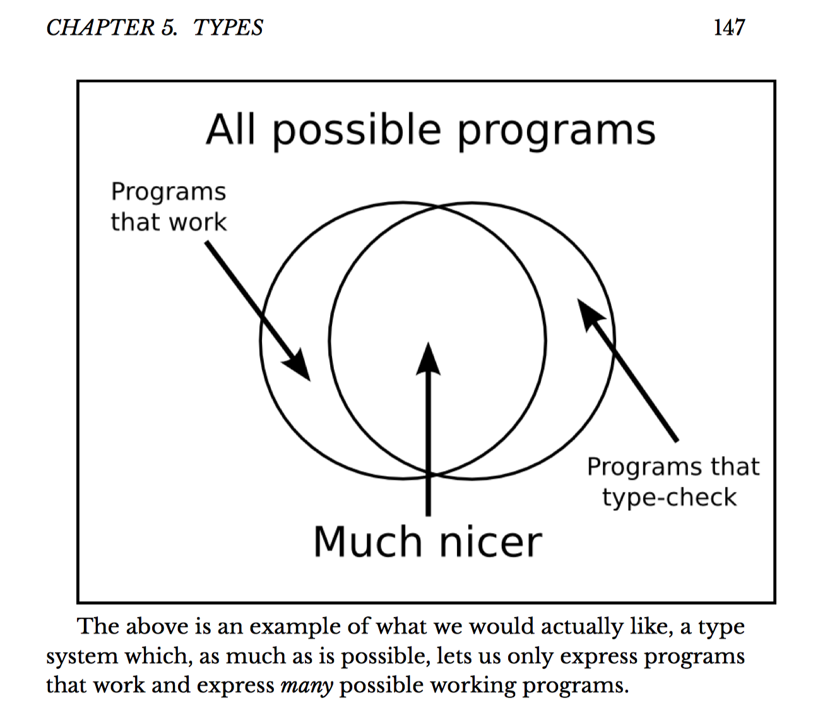

% Rank-N Types Are Freakin' Sweet
% Chris Allen
% May 28, 2016

# Rank N Types

- Are awesome

- Require understanding polymorphism in Haskell a bit first

- So this talk doesn't really start at Rank-N types.

# Polymorphism

```haskell
id   ::          a -> a
(+1) :: Num a => a -> a
(+1) ::        Int -> Int
```

<!-- # Simply typed lambda calculus
```haskell
\x -> \y -> x
```
# System F -->

# Universal quantification

The type of identity can be read as,

```haskell
id :: forall a . a -> a
```

For **all** _a_, _a_ to _a_

# Binders for type variables

It turns out, our binders for types behave a lot like lambdas.

```haskell
forall x . x
\x -> x
```

This is how we bind variables to concrete types, characterize polymorphism.

# Rank-1

This is what Haskell type signatures all default to.

Prenex-form is "outermost left-most".

# Prenex form

Means that when Haskell fills in the "forall" for you, this:

```haskell
a -> b -> a
```

Turns into:

```haskell
forall a b . a -> b -> a
```

# Currying still applies

WHEN DID THIS

```haskell
forall a b . a -> b -> a
```

BECOME MORE BEAUTIFUL THAN THIS?

```haskell
forall a. a -> (forall b. b -> a)
```

# But yeah, same deal.

```haskell
forall a b . a -> b -> a
-- equivalent.
forall a. a -> (forall b. b -> a)
```

# ExplicitForAll

That was real syntax! You can write the foralls yourself!

```haskell
{-# LANGUAGE ExplicitForAll #-}

length :: forall a . a -> Int
length = ...
```

# It seems like this should work

`tuple.hs`

# Tension!

A tension between what terms can be permitted in our type system and what badness we can prevent.

# Morality and legality are orthogonal

There are programs we can write which are valid, but which a type system will reject. Part of PL and type theory research is making this valid-but-illegal space as small as possible.

# Bad type system


# Good type system



# Rank-2

# Higher rank polymorphism expansionism

Higher rank polymorphism expands what our type system permits us to say, without any cost in correctness.

# Examples from lens

```haskell
{-# LANGUAGE Rank2Types #-}

type Lens s t a b =
  forall f . Functor f => (a -> f b) -> s -> f t
```

# Rank-N

`ranks.hs`
